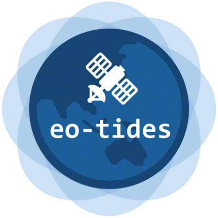
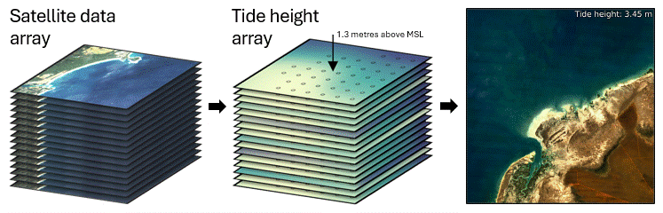

# `eo-tides`: Tide modelling tools for large-scale satellite earth observation analysis



[](https://pypi.org/project/eo-tides/)
[](https://github.com/GeoscienceAustralia/eo-tides/actions/workflows/main.yml?query=branch%3Amain)

[](https://codecov.io/gh/GeoscienceAustralia/eo-tides)
[](https://img.shields.io/github/license/GeoscienceAustralia/eo-tides)

- **Github repository**: <https://github.com/GeoscienceAustralia/eo-tides/>
- **Documentation** <https://GeoscienceAustralia.github.io/eo-tides/>

> [!CAUTION]
> This package is a work in progress, and not currently ready for operational use.

`eo-tides` provides powerful parallelized tools for integrating satellite Earth observation data with tide modelling. 🛠️🌊🛰️

`eo-tides` combines advanced tide modelling functionality from the [`pyTMD`](https://pytmd.readthedocs.io/en/latest/) package with [`pandas`](https://pandas.pydata.org/docs/index.html), [`xarray`](https://docs.xarray.dev/en/stable/) and [`odc-geo`](https://odc-geo.readthedocs.io/en/latest/), providing a suite of flexible tools for efficient analysis of coastal and ocean Earth observation data – from regional, continental, to global scale.

These tools can be applied to petabytes of freely available satellite data (e.g. from [Digital Earth Australia](https://knowledge.dea.ga.gov.au/) or [Microsoft Planetary Computer](https://planetarycomputer.microsoft.com/)) loaded via Open Data Cube's [`odc-stac`](https://odc-stac.readthedocs.io/en/latest/) or [`datacube`](https://opendatacube.readthedocs.io/en/latest/) packages, supporting coastal and ocean earth observation analysis for any time period or location globally.



## Highlights

- 🌊 Model tides from multiple global ocean tide models in parallel, and return tide heights in standardised `pandas.DataFrame` format for further analysis
- 🛰️ "Tag" satellite data with tide height and stage based on the exact moment of image acquisition
- 🌐 Model tides for every individual satellite pixel, producing three-dimensional "tide height" `xarray`-format datacubes that can be integrated with satellite data
<!-- - 🎯 Combine multiple tide models into a single locally-optimised "ensemble" model informed by satellite altimetry and satellite-observed patterns of tidal inundation -->
- 📈 Calculate statistics describing local tide dynamics, as well as biases caused by interactions between tidal processes and satellite orbits
- 🛠️ Validate modelled tides using measured sea levels from coastal tide gauges (e.g. [GESLA Global Extreme Sea Level Analysis](https://gesla.org/))

## Supported tide models

`eo-tides` supports [all ocean tide models supported by `pyTMD`](https://pytmd.readthedocs.io/en/latest/getting_started/Getting-Started.html#model-database). These include:

- [Empirical Ocean Tide model](https://doi.org/10.5194/essd-13-3869-2021) (EOT20)
- [Finite Element Solution tide models](https://doi.org/10.5194/os-2020-96) (FES2022, FES2014, FES2012)
- [TOPEX/POSEIDON global tide models](https://www.tpxo.net/global) (TPXO10, TPXO9, TPXO8)
- [Global Ocean Tide models](https://doi.org/10.1002/2016RG000546) (GOT5.6, GOT5.5, GOT4.10, GOT4.8, GOT4.7)
- [Hamburg direct data Assimilation Methods for Tides models](https://doi.org/10.1002/2013JC009766) (HAMTIDE11)

For instructions on how to set up these models for use in `eo-tides`, refer to [Setting up tide models](setup.md).

## Citing `eo-tides`

To cite `eo-tides` in your work, please use the following citation:

```
Bishop-Taylor, R., Sagar, S., Phillips, C., & Newey, V. (2024). eo-tides: Tide modelling tools for large-scale satellite earth observation analysis. https://github.com/GeoscienceAustralia/eo-tides
```
