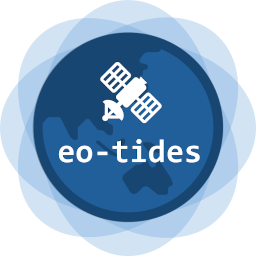

# `eo-tides`: Tide modelling tools for large-scale satellite earth observation analysis

[](https://img.shields.io/github/v/release/GeoscienceAustralia/eo-tides)
[](https://github.com/GeoscienceAustralia/eo-tides/actions/workflows/main.yml?query=branch%3Amain)
[](https://img.shields.io/github/commit-activity/m/GeoscienceAustralia/eo-tides)
[](https://img.shields.io/github/license/GeoscienceAustralia/eo-tides)

!!! warning

    Note: This package is a work in progress, and not currently ready for operational use.

The `eo-tides` package provides tools for analysing coastal and ocean satellite earth observation data using information about ocean tides.

`eo-tides` combines advanced tide modelling functionality from the [`pyTMD`](https://pytmd.readthedocs.io/en/latest/) package and integrates it with `pandas`, `xarray` and `odc-geo` to provide a powerful set of parallelised tools for integrating satellite imagery with tide data – from local, regional to continental scale.

Some key functionality includes the ability to:

- Model tides from multiple global ocean tide models in parallel, and return tide heights in standardised `pandas.DataFrame` format for further analysis
- "Tag" satellite data with tide height and stage based on the exact moment of image acquisition
- Model tides for every individual satellite pixel, producing three-dimensional "tide height" `xarray`-format datacubes that can be combined with satellite data
- Combine multiple tide models into a single locally-optimised "ensemble" model informed by satellite altimetry and satellite-observed patterns of tidal inundation
- Calculate statistics describing local tide dynamics, as well as biases caused by interactions between tidal processes and satellite orbits
- Validate modelled tides using measured sea levels from coastal tide gauges (e.g. GESLA)

These tools can be applied directly to petabytes of freely available satellite data (e.g. from Digital Earth Australia or Microsoft Planetary Computer) loaded via Open Data Cube's `odc-stac` or `datacube` packages, supporting coastal and ocean earth observation analysis for any time period or location globally.

## Supported tide models

`eo-tides` supports [all ocean tide models supported by `pyTMD`](https://pytmd.readthedocs.io/en/latest/getting_started/Getting-Started.html#model-database). These include:

- [Finite Element Solution tide models](https://doi.org/10.5194/os-2020-96) (`FES2022`, `FES2014`, `FES2012`)
- [TOPEX/POSEIDON global tide models](https://www.tpxo.net/global) (`TPXO10`, `TPXO9`, `TPXO8`)
- [Global Ocean Tide models](https://doi.org/10.1002/2016RG000546) (`GOT5.6`, `GOT5.5`, `GOT4.10`)
- [Empirical Ocean Tide models](https://doi.org/10.5194/essd-13-3869-2021) (`EOT20`)
- [Hamburg direct data Assimilation Methods for Tides models](https://doi.org/10.1002/2013JC009766) (`HAMTIDE11`)

For instructions on how to set up these models for use in `eo-tides`, refer to [Setting up tide models](setup.md).

## Citing `eo-tides`

To cite `eo-tides` in your work, please use the following citation:

```
Bishop-Taylor, R., Sagar, S., Phillips, C., & Newey, V. (2024). eo-tides: Tide modelling tools for large-scale satellite earth observation analysis [Computer software]. https://github.com/GeoscienceAustralia/eo-tides
```

## Next steps

To get started, first follow the [guide to installing `eo-tides`](install.md), and then [set up one or multiple global ocean tide models](setup.md).
