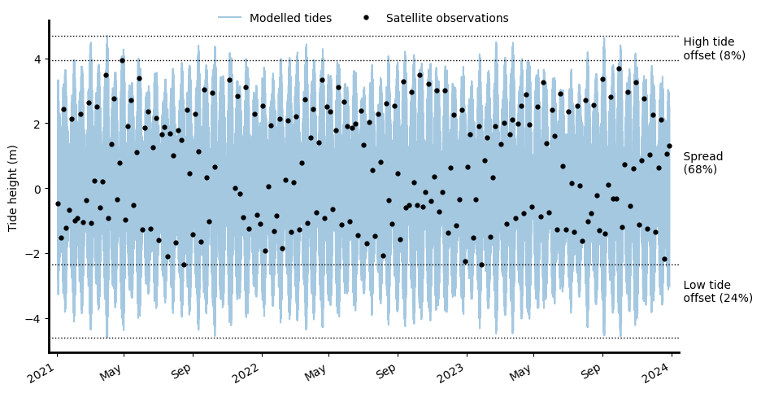

# Summary
Satellite Earth observation offers an unparalleled method to view and examine dynamic coastal environments over large temporal and spatial scales. The variable influence of tide in these regions provides another dimension to increase the utility of coastal Earth obseration data. `eo-tides` facilitates the attribution of tidal dimensions to satellite Earth observation data, the combination of which delivers a powerful reimagining of traditional multi-temporal Earth observation data analysis. Conventionally, satellite data dimensions consider the geographical 'where' and the temporal 'when' of data acquisition. The addition of tide height allows exploration of the 'where' in the local tide range (e.g. high or low tide) and 'when' in the tidal cycle (e.g. spring, neap, ebb or flow tides) that data was collected. This concept has been used to map the mean annual position of continental coastlines [@bishop2021mapping], generate national intertidal zone digital elevation models [@bishop2019NIDEM] and create synthetic imagery composites of coasts at low and high tide [@sagar2018composites].

# Statement of need
`eo-tides` is a powerful python based API that facilitates the modelling and attribution of global tide heights to satellite data for improved data utility and analysis in coastal and marine research. It leverages satellite data acquisition times, a wide range of global ocean tide models and a python based tide prediction software, `pyTMD` [@tyler_sutterley_2024]. `eo-tides` further adopts functionality from the `pandas` [@The_pandas_development_team_pandas-dev_pandas_Pandas], `xarray` [@Hoyer_xarray_N-D_labeled_2017] and `odc-geo` [@odc-geo] packages to deliver a suite of flexible and parallelized Earth observation (EO) based tide modelling tools that can be applied to petabytes of coastal satellite data for any time period or location globally. 

## Modelling tides
At it's core, `eo_tides` upscales sophisticated ocean tide modelling from the `pyTMD` package [@tyler_sutterley_2024] to scales applicable to EO data e.g. 10m spatial pixel resolution with Sentinel-2 imagery.

[TODO: Insert text here about the core functions of the `pyTMD` package with comment on the range of supported global tide models. Segue into how `eo-tides` enables the application of `pyTMD` modelling at EO appropriate scale]

The tide modelling functionality in `eo-tides` can be used independently of EO data, e.g. for any application where you need to generate a time series of tide heights. However, it also underpins the more complex EO-related functions in the `eo-tides` package. Tide modelling functionality is further provided to support modelling of tidal phases at any location and time. This can be used to classify tides into high and low tide observations, or determine whether the tide was rising (i.e. flow tide) or falling (i.e. ebb tide) at any point in time.

## Combining tides with satellite data
The attribution of corresponding tide heights to coastal EO data is the major focus of the `eo-tides` package. When combining tide heights with satellite data, `eo-tides` offers two approaches that differ in  complexity and performance. A fast and efficient method for assigning tide heights to whole dataset timesteps is offered for small scale applications where tides are unlikely to vary across a study area. In contrast, for large scale, seamless coastal EO datasets, `eo-tides` offers an approach that models tides through both time and space, returning a tide height for every satellite pixel in every dataset timestep.

Using the former approach, the tide height at the geographic-centroid of the dataset is attributed to each timestep, representing the relative trend of the tide dynamics for the area of interest at that moment in time. Having tide height as a variable allows the selection and analysis of satellite data using information about tides. For example, in any area of interest, all available timesteps could be sorted by tide height, then the lowest and highest tide images in the time series are identifiable and able to be compared.

However, in reality, tides vary spatially – potentially by several metres in areas of complex tidal dynamics. This means that an individual satellite dataset can capture a range of tide conditions. The pixel-based, seamless tide height attribution approach is well suited for applications that require localised information on tides. For efficient processing, this approach first models tides into a low resolution grid surrounding each satellite image in the time series. This lower resolution data includes a buffer around the extent of the satellite data so that tides can be modelled seamlessly across analysis boundaries. Optionally, users can interpolate and re-project the low resolution tide data back into the resolution of the input satellite image, resulting in an individual tide height for every pixel in the dataset through time and space.

Further functionality in this approach allows users to calculate and return timesteps from the modelled tide height array to reveal important features of the input satellite time series. These include the minimum, maximum and median satellite-observed tide heights in the array which can be exploited for deeper analysis, such as coastline delineation [@bishop2021mapping].

## Calculating tide statistics and satellite biases
Complex interactions between temporal tide dynamics and the regular overpass timing of orbiting sensors like Landsat, Sentinel-1 and Sentinel-2 mean that satellites often do not observe the entire tidal cycle. Biases in satellite coverage of the tidal cycle can mean that tidal extremes (e.g. the lowest or highest tides at a location) may either never be captured by satellites, or be over-represented in the satellite EO record. Local tide dynamics can cause these biases to vary greatly both through time and spatially [@bishop2019NIDEM], making it challenging to consistently analyse and compare coastal processes consistently - particularly for large-scale (e.g. regional or global) analyses. 

To ensure that coastal EO analyses are not inadvertently affected by tide biases, it is important to understand and compare how well the tides observed by satellites match the full range of modelled tides at a location. Statistical capabilities in `eo-tides` compare the subset of tides observed by satellite data against the full range of tides modelled at a regular interval through time across the entire time period covered by the satellite dataset. This comparison is used to calculate several useful statistics that summarise how well your satellite data captures real-world tidal conditions. These statistics include: 

  1. Spread: The proportion of the full modelled astronomical tidal range that was observed by satellites. A high value indicating good coverage of the tide range.
  2. Offset high: The proportion of the highest tides not observed by satellites at any time, as a proportion of the full modelled astronomical tidal range. A high value indicates that the satellite data is biased towards never capturing high tides.
  3. Offset low: The proportion of the lowest tides not observed by satellites at any time, as a proportion of the full modelled astronomical tidal range. A high value indicates that the satellite data is biased towards never capturing low tides.

An interrogation of satellite tide-bias in any area of interest using `eo-tides` statistical functionality will return a report and plot (*Figure 1*), adding insightful tide-based context to your coastal EO analysis.

```
  Using tide modelling location: 122.21, -18.00
  Modelling tides with EOT20

  - Modelled astronomical tide range: 9.30 metres.
  - Observed tide range: 6.29 metres.

  - 68% of the modelled astronomical tide range was observed at this location.
  - The highest 8% (0.77 metres) of the tide range was never observed.
  - The lowest 24% (2.25 metres) of the tide range was never observed.

  - Mean modelled astronomical tide height: -0.00 metres.
  - Mean observed tide height: 0.69 metres.

  - The mean observed tide height was 0.69 metres higher than the mean modelled astronomical tide height.
```

<div style="margin-left: 40px; margin-right: 40px; margin-bottom: 20px;">
<b> Figure 1 </b> In this satellite dataset where tide modelling was applied for the geometric centroid 122.21, -18.00, using tide model EOT20, the satellite captured a biased proportion of the tide range at this location: only observing ~68% of the full modelled (astronomical) tide range, and never observing the lowest 24% of tides. The plot visually demonstrates the relationships between satellite observed tide-heights (black dots) and modelled astronomical tide height (blue) for this location. Additionally, the report provides absolute values describing the satellite-observed tidal behaviours for any given location. </div>

## Validating modelled tide heights
The tide models supported by `eo-tides` can vary significantly in accuracy across the world's coastlines. Evaluating the accuracy of modelled tides is critical for ensuring that resulting marine or coastal EO analyses are reliable and useful.

Validation functionality in `eo-tides` provides a convenient tool for loading high-quality sea-level measurements from the GESLA Global Extreme Sea Level Analysis [@GESLAv3] archive – a global dataset of almost 90,713 years of sea level data from 5,119 records across the world. This data can be used to compare against tides modelled using `eo-tides` to calculate the accuracy of your tide modelling and identify the optimal tide models to use for your study area.

 `eo-tides` has designed the loading of GESLA data to be identical in format to the tide modelling data load and correlations between GESLA data and modelled tide heights are quantified through the calculation of accuracy statistics that include the Root Mean Square Error (RMSE), Mean Absolute Error (MAE), R-squared and bias.

Furthermore, different ocean tide models perform differently in different locations. `eo-tides` supports the comparison of multiple tide models, evaluating them against GESLA data, to empower users to make informed decisions and choose the optimal tide model that best suits their location or application with confidence.

# Research projects
Mention (if applicable) a representative set of past or ongoing research projects using the software and recent scholarly publications enabled by it.

# Acknowledgements
Acknowledgement of any financial support.

# References