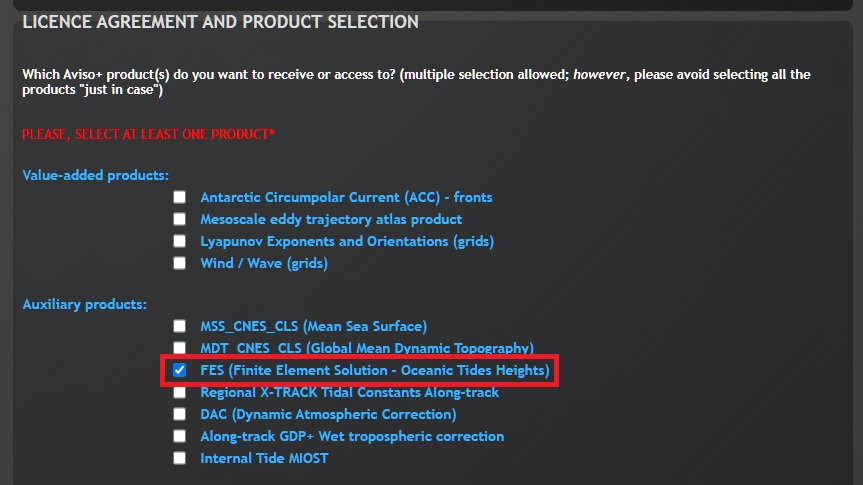

# Setting up tide models

!!! important

    `eo-tides` provides tools for modelling tides using global ocean tide models but does not host or maintain the model data itself. **Users are responsible for accessing, using, and citing ocean tide model data in compliance with each model's licensing terms.**

Once you [have installed `eo-tides`](install.md), we need to download and set up the external global ocean tide model data required for `eo-tides` to work.
The following documentation provides instructions for getting started with several common global ocean tide models.

!!! tip

    Please refer to the [`pyTMD` documentation](https://pytmd.readthedocs.io/en/latest/getting_started/Getting-Started.html#directories) for additional instructions covering all other supported tide models.

## Tide model files and harmonic tidal constituents

Tides are driven by complex gravitational interactions between the Earth, moon, and sun, which create periodic and predictable variations in sea level. These variations can be decomposed into a set of **harmonic tidal constituents** (also known as "tidal constants") with unique amplitudes and phases that correspond to different celestial influences.

**When downloading tide model data, you are retrieving these tidal constituents rather than direct modelled or measured tidal height outputs.** Global ocean tide models use amplitudes and phases from these tidal constituents to precisely reconstruct tidal variations, allowing them to predict tide heights for any location on the planet and any moment in time — even into the future.

!!! tip

    For a deep dive into the science of tide modelling and how harmonic tidal constituents are used by global ocean tide models, refer to [`pyTMD` Ocean and Load Tides documentation.](https://pytmd.readthedocs.io/en/latest/background/Tides.html)

## Setting up a tide model directory

As a first step, we need to create a directory that will contain our tide model data.
This directory will be accessed by all `eo-tides` functions.
For example, we might want to store our tide model data in a directory called `tide_models/`:

=== "Relative path"

    <pre><code>tide_models/</code></pre>

=== "Full path (Windows)"

    <pre><code><span style="color: #bbb;">D:/projects/</span>tide_models/</code></pre>

=== "Full path (Linux)"

    <pre><code><span style="color: #bbb;">/home/user/projects/</span>tide_models/</code></pre>

!!! tip

    This directory doesn't need to be called `tide_models`; use any name and/or location that is convenient to you and accessible from your Python environment. Please refer to [the documentation below](#configuring-eo-tides-to-use-tide-model-directory) for further details on configuring `eo-tides` to use this directory.

## Downloading tide model data

Now we need to download some data from one or more models, and save this into our tide model directory.
Follow the guides below for some of the most commonly used global ocean tide models:

??? note "EOT20 Empirical Ocean Tide model (default)"

    ### EOT20 Empirical Ocean Tide model (default)

    1. Visit [EOT20 - A global Empirical Ocean Tide model from multi-mission satellite altimetry](https://doi.org/10.17882/79489)
    2. Under `Data`, click `Download`:

        

    3. Create a new directory inside your [tide model directory](#setting-up-a-tide-model-directory) called `EOT20/` to store the EOT20 model files.

    4. Extract the `85762.zip` and then `ocean_tides.zip` into this new directory.

    You should end up with the following directory structure containing the extracted NetCDF files:

    ```
    tide_models/EOT20/ocean_tides/
        |- 2N2_ocean_eot20.nc
        |- ...
        |- T2_ocean_eot20.nc
    ```

??? note "FES2022 Finite Element Solution tide models"

    ### FES2022 Finite Element Solution tide models

    1. [Register with AVISO+](https://www.aviso.altimetry.fr/en/data/data-access/registration-form.html), and select `FES (Finite Element Solution - Oceanic Tides Heights)` from the `Licence Agreement and product selection` section:

        

    2. Scroll to the bottom of the page and agree to the licence agreement. Your request will be sent for approval (this may take several days).
    3. Once you are notified via email that your registration and access is approved, login to [MY AVISO+](https://www.aviso.altimetry.fr/en/my-aviso-plus.html).
    4. Once logged in, select [My products](https://www.aviso.altimetry.fr/en/my-aviso-plus/my-products.html) in the left-hand menu:

        

    5. `FES (Finite Element Solution - Oceanic Tides Heights)` should appear under `Your current subscriptions.` Right click on `Ftp`, and copy the FTP address.

        

    6. Using an FTP client like FileZilla, log in to the FTP using your AVISO+ username and password:

        

    7. Navigate to `/auxiliary/tide_model/`, and download the contents of one of the following FTP directory:

        - `fes2022b/ocean_tide_20241025/` (if using standard model data)
        - `fes2022b/ocean_tide_extrapolated/` (if using extrapolated model data)

        !!! tip

            The "extrapolated" version of FES models have been extended inland using a simple "nearest" extrapolation method to ensure data coverage across the entire coastal zone. This can be useful for ensuring you always return a modelled tide, but can also introduce uncertainty into your modelling (particularly in complex regions such as narrow peninsulas or inlets/embayments).

    8. Create a new nested folder inside your [tide model directory](#setting-up-a-tide-model-directory) called either `fes2022b/ocean_tide_20241025/` (if using standard model data) or `fes2022b/ocean_tide_extrapolated/` (if using extrapolated model data) to store your dowloaded files.

    9. Copy your downloaded files into your new tide model directory folder, then uncompress each compressed `*.nc.xz` file (e.g. `xz -dk *.nc.xz`).

    You should end up with the following directory structure containing uncompressed `.nc`-format NetCDF files:

    ```
    tide_models/fes2022b/ocean_tide_20241025/
        |- 2n2_fes2022.nc
        |- ...
        |- t2_fes2022.nc
    ```
    Or:
    ```
    tide_models/fes2022b/ocean_tide_extrapolated/
        |- 2n2_fes2022.nc
        |- ...
        |- t2_fes2022.nc
    ```

??? note "FES2014 Finite Element Solution tide models"

    ### FES2014 Finite Element Solution tide models

    1. [Register with AVISO+](https://www.aviso.altimetry.fr/en/data/data-access/registration-form.html), and select `FES (Finite Element Solution - Oceanic Tides Heights)` from the `Licence Agreement and product selection` section:

        

    2. Scroll to the bottom of the page and agree to the licence agreement. Your request will be sent for approval (this may take several days).
    3. Once you are notified via email that your registration and access is approved, login to [MY AVISO+](https://www.aviso.altimetry.fr/en/my-aviso-plus.html).
    4. Once logged in, select [My products](https://www.aviso.altimetry.fr/en/my-aviso-plus/my-products.html) in the left-hand menu:

        

    5. `FES (Finite Element Solution - Oceanic Tides Heights)` should appear under `Your current subscriptions.` Right click on `Ftp`, and copy the FTP address.

        

    6. Using an FTP client like FileZilla, log in to the FTP using your AVISO+ username and password:

        

    7. Navigate to `/auxiliary/tide_model/`, and download the contents of one or more of the following directories:

        - `fes2014_elevations_and_load/fes2014b_elevations/`
        - `fes2014_elevations_and_load/fes2014b_elevations_extrapolated/`

        !!! tip

            The "extrapolated" version of FES have been extended inland using a simple "nearest" extrapolation method to ensure data coverage across the entire coastal zone. This can be useful for ensuring you always return a modelled tide, but can also introduce uncertainty into your modelling (particularly in complex regions such as narrow peninsulas or inlets/embayments).

    8. Create a new directory inside your [tide model directory](#setting-up-a-tide-model-directory) called `fes2014/` to store the FES2014 model files.

    9. Extract `ocean_tide.tar.xz` or `ocean_tide_extrapolated.tar.xz` into this directory (e.g. `tar -xf ocean_tide.tar.xz`).

    You should end up with the following directory structure containing the extracted NetCDF files:

    ```
    tide_models/fes2014/ocean_tide/
       |- 2n2.nc
       |- ...
       |- t2.nc
    ```
    Or:
    ```
    tide_models/fes2014/ocean_tide_extrapolated/
       |- 2n2.nc
       |- ...
       |- t2.nc
    ```

??? note "GOT Global Ocean Tide models"

    ### GOT Global Ocean Tide models

    1. Visit [Ocean tide models](https://earth.gsfc.nasa.gov/geo/data/ocean-tide-models)
    2. Under `Short-period (diurnal/semidiurnal) tides`, click choose your desired GOT model:

        

    3. Create a new directory inside your [tide model directory](#setting-up-a-tide-model-directory) called either `GOT4.7/`, `got4.8/`, `GOT4.10c/`, `GOT5.5/` or `GOT5.6/` to store the GOT model files.

    4. Extract your downloaded `.tar.gz` file into this new directory.

    You should end up with the following directory structure containing the extracted NetCDF files:

    ```
    tide_models/GOT5.6/ocean_tides/
        |- ...
    ```
    Or:
    ```
    tide_models/GOT5.5/ocean_tides/
        |- ...
    ```
    !!! important

        Note that GOT5.6 requires that both GOT5.6 and GOT5.5 model files are downloaded and extracted.

    Or:
    ```
    tide_models/GOT4.10c/grids_oceantide/
        |- ...
    ```
    Or:
    ```
    tide_models/got4.8/grids_oceantide/
        |- ...
    ```
    Or:
    ```
    tide_models/GOT4.7/grids_oceantide/
        |- ...
    ```

??? note "TPXO Global Tidal Models"

    ### TPXO Global Tidal Models

    1. Visit [TPXO Registration](https://www.tpxo.net/tpxo-products-and-registration)
    2. Follow instructions to email TPXO authors for access, providing your name, institution, your intended application/use case, and which TPXO models you need ("TPXO10-atlas-v2 netcdf" or "TPXO9-atlas-v5 netcdf" are recommended to [enable clipping](#clipping-model-files-to-improve-performance)).
    3. If your request is approved, you will be emailed an invite to an app.box.com folder. Open this link, then click "Download" on the top-right to download your zipped model files.

        

    4. Create a new directory inside your [tide model directory](#setting-up-a-tide-model-directory) called either `TPXO10_atlas_v2/` or `TPXO9_atlas_v5/` to store the TPXO model files.

    5. Extract your zipped model files (e.g. `TPXO10_atlas_v2_nc.zip` or `TPXO9_atlas_v5_nc.zip`) into this new directory.

    You should end up with the following directory structure containing the extracted NetCDF files, depending on the model you downloaded:

    ```
    tide_models/TPXO10_atlas_v2/
        |- grid_tpxo10atlas_v2.nc
        |- ...
        |- u_s2_tpxo10_atlas_30_v2.nc
    ```
    Or:
    ```
    tide_models/TPXO9_atlas_v5/
        |- grid_tpxo9_atlas_30_v5.nc
        |- ...
        |- u_s2_tpxo9_atlas_30_v5.nc
    ```

??? note "DTU Technical University of Denmark tide models"

    ### DTU Technical University of Denmark tide models

    1. Visit [DTU23 Global Ocean Tide model (DTU23_OceanTide)](https://data.dtu.dk/articles/dataset/DTU23_Global_Ocean_Tide_model_DTU23_OceanTide_/23828874)
    2. Download `DTU23_OceanTide.zip`

    

    3. Create a new directory inside your [tide model directory](#setting-up-a-tide-model-directory) called `DTU23_OceanTide` to store the DTU23 model files.
    4. Extract your zipped model files (e.g. `DTU23_OceanTide.zip`) into this new directory.
    5. Uncompress all compressed `*.d.gz` format files inside the `DTU23` folder (e.g. `gunzip -dk *.gz` from a terminal).

    You should end up with the following directory structure containing uncompressed `.d`-format files:

    ```
    tide_models/DTU23_OceanTide/DTU23/
        |- K1_DTU23.d
        |- ...
        |- S2_DTU23.d
    ```

!!! tip

    To allow you to improve tide modelling performance by clipping your tide model files ([see below](#clipping-model-files-to-improve-performance)), we recommend downloading NetCDF-format versions of tide models wherever possible.

## Configuring `eo-tides` to use tide model directory

`eo-tides` can be pointed to the location of your [tide model directory](#setting-up-a-tide-model-directory) and your downloaded tide model data in two ways:

### 1. Using the `directory` function parameter

All tide modelling functions from `eo-tides` provide a `directory` parameter that can be used to specify **either the relative or full/absolute path** to your tide model directory.

For example, using the [`eo_tides.model.model_tides`](api.md#eo_tides.model.model_tides) function:

=== "Relative path"

    ```py hl_lines="8"
    import pandas as pd
    from eo_tides.model import model_tides

    model_tides(
            x=155,
            y=-35,
            time=pd.date_range("2022-01-01", "2022-01-04", freq="1D"),
            directory="tide_models/"  # relative path to `tide_models` directory
    )
    ```

=== "Full path (Windows)"

    ```py hl_lines="8"
    import pandas as pd
    from eo_tides.model import model_tides

    model_tides(
            x=155,
            y=-35,
            time=pd.date_range("2022-01-01", "2022-01-04", freq="1D"),
            directory="D:/projects/tide_models/"  # full path to `tide_models`
    )
    ```

=== "Full path (Linux)"

    ```py hl_lines="8"
    import pandas as pd
    from eo_tides.model import model_tides

    model_tides(
            x=155,
            y=-35,
            time=pd.date_range("2022-01-01", "2022-01-04", freq="1D"),
            directory="/home/user/projects/tide_models/"  # full path to `tide_models`
    )
    ```

### 2. (Advanced) Setting the `EO_TIDES_TIDE_MODELS` environmental variable

For more advanced usage, you can set the path to your [tide model directory](#setting-up-a-tide-model-directory) by setting the `EO_TIDES_TIDE_MODELS` environment variable.

This should be set to **a full/absolute path** to ensure it can be accessed from anywhere you run `eo-tides` code:

=== "Full path (Windows)"

    ```py hl_lines="2"
    import os
    os.environ["EO_TIDES_TIDE_MODELS"] = "D:/projects/tide_models/"
    ```

=== "Full path (Linux)"

    ```py hl_lines="2"
    import os
    os.environ["EO_TIDES_TIDE_MODELS"] = "/home/user/projects/tide_models/"
    ```

All tide modelling functions from `eo-tides` will check for the presence of the `EO_TIDES_TIDE_MODELS` environment variable, and use it as the default `directory` path if available (the `EO_TIDES_TIDE_MODELS` environment variable will be overuled by the `directory` parameter if provided).

!!! tip

    Setting the `EO_TIDES_TIDE_MODELS` environment variable can be useful when the location of your tide model directory might change between different environments, and you want to avoid hard-coding a single location via the `directory` parameter.

## Verifying available and supported models

You can check what tide models have been correctly set up for use by `eo-tides` using the [`eo_tides.utils.list_models`](api.md#eo_tides.utils.list_models) function:

```py
from eo_tides.utils import list_models

available_models, supported_models = list_models(directory="tide_models/")
```

This will print out a useful summary, with available models marked with a ✅:

```
──────────────────────────────────────────────────────────
 󠀠🌊  | Model        | Expected path
──────────────────────────────────────────────────────────
 ✅  │ EOT20        │ tide_models/EOT20/ocean_tides
 ❌  │ FES2014      │ tide_models/fes2014/ocean_tide
 ✅  │ HAMTIDE11    │ tide_models/hamtide
 ❌  │ TPXO9.1      │ tide_models/TPXO9.1/DATA
 ...   ...            ...
──────────────────────────────────────────────────────────

Summary:
Available models: 2/50
```

!!! tip

    If the models that you saved are not marked as available in this summary, check that they were saved to the expected path as identified in the summary table.

## Clipping model files to improve performance

!!! important "Highly recommended"

    Clipping your model files to a smaller spatial extent is **highly recommended**, unless you are specifically running global-scale analyses.

Running tide modelling on the default tide modelling data provided by external providers can be slow due to the large size of these files (especially for high-resolution models like FES2022).
To improve performance, it can be extremely useful to clip your model files to a smaller region of interest (e.g. the extents of your country or coastal region).
This can **greatly** improve run-times: potentially speeding up your tide modelling by over 10 times for large models!

Once you have downloaded and verified your tide model data, you can use the [`eo_tides.utils.clip_models`](api.md#eo_tides.utils.clip_models) function to automatically clip your data, and export them to a new tide modelling directory:

```py
from eo_tides.utils import clip_models

clip_models(
    input_directory="tide_models/",
    output_directory="tide_models_clipped/",
    bbox=(113.3, -43.6, 153.6, -10.7),
)
```

When you run `clip_models`, the function will automatically identify suitable NetCDF-format models in your input directory, and clip each of them to the extent of your bounding box (specified as `(left, bottom, right, top)` in EPSG:4326 degree coordinates).
After each model is clipped, the result is exported to your selected output directory and verified to ensure the clipped data is suitable for tide modelling:

```text
Preparing to clip suitable NetCDF models: ['HAMTIDE11', 'EOT20']

Clipping HAMTIDE11: 100%|██████████| 9/9 [00:03<00:00,  2.60it/s]
✅ Clipped model exported and verified
Clipping EOT20: 100%|██████████| 17/17 [00:07<00:00,  2.36it/s]
✅ Clipped model exported and verified

Outputs exported to tide_models_clipped/
```

You can now pass this new clipped tide model directory to all future `eo_tides` function calls for improved tide modelling performance, e.g.:

```py hl_lines="8"
import pandas as pd
from eo_tides.model import model_tides

model_tides(
        x=155,
        y=-35,
        time=pd.date_range("2022-01-01", "2022-01-04", freq="1D"),
        directory="tide_models_clipped/"
)
```

> Example of tide model data for the M2 tidal constituent from `EOT20` clipped to Australia:

{: width="800"}

!!! tip

    Because only NetCDF-format tide models can be clipped, we recommend downloading NetCDF versions of your tide models wherever possible.

## Next steps

Now that you have [installed `eo-tides`](install.md) and set up some tide models, you can learn how to use `eo-tides` for [modelling tides and analysing satellite data!](notebooks/Model_tides.ipynb)
