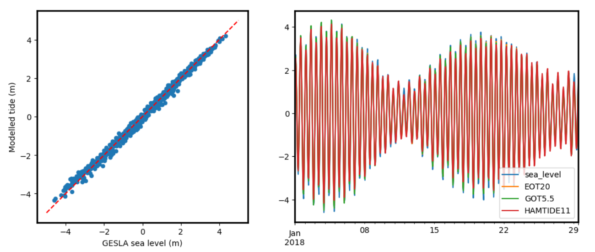

# Summary

The `eo-tides` package provides powerful parallelized tools for integrating satellite Earth observation (EO) data with ocean tide modelling. The package provides a flexible Python-based API for modelling and attributing tide heights to a time-series of satellite images based on the spatial extent and acquisition time of each satellite observation (\autoref{fig:abstract}).

`eo-tides` leverages advanced tide modelling functionality from the `pyTMD` tide prediction software [@pytmd], combining this fundamental tide modelling capability with EO spatial analysis tools from `odc-geo` [@odcgeo]. This allows tides to be modelled in parallel automatically using over 50 supported tide models, and returned in standardised `pandas` [@reback2020pandas; @mckinney-proc-scipy-2010] and `xarray` [@Hoyer_xarray_N-D_labeled_2017] data formats for further analysis.

Tools from `eo-tides` are designed to be applied directly to petabytes of freely available satellite data loaded from the cloud using Open Data Cube's `odc-stac` or `datacube` packages (e.g. using [Digital Earth Australia](https://knowledge.dea.ga.gov.au/guides/setup/gis/stac/) or [Microsoft Planetary Computer's](https://planetarycomputer.microsoft.com/) SpatioTemporal Asset Catalogues). Additional functionality enables evaluating potential satellite-tide biases, and validating modelled tides using external tide gauge data — both important considerations for assessing the reliability and accuracy of coastal EO workflows. In combination, these open source tools support the efficient, scalable and robust analysis of coastal EO data for any time period or location globally.

# Statement of need

Satellite remote sensing offers an unparalleled method to view and examine dynamic coastal environments over large temporal and spatial scales [@turner2021satellite; @vitousek2023future]. However, the variable and sometimes extreme influence of ocean tides in these regions can complicate analyses, making it difficult to separate the influence of changing tides from patterns of true coastal change over time [@vos2019coastsat]. This is a particularly significant challenge for continental- to global-scale coastal EO analyses, where failing to account for complex tide dynamics can lead to inaccurate or misleading insights into coastal processes observed by satellites.

Conversely, information about ocean tides can also provide unique environmental insights that can greatly enhance the utility of coastal EO data. Conventionally, satellite data dimensions consider the geographical "where" and the temporal "when" of data acquisition. The addition of tide height as a new analysis dimension allows data to be filtered, sorted and analysed with respect to tidal processes, delivering a powerful re-imagining of traditional multi-temporal EO data analysis [@sagar2017item]. For example, satellite data can be analysed to focus on specific ecologically-significant tidal stages (e.g. high, low tide, spring or neap tides) or on particular tidal processes (e.g. ebb or flow tides; @sent2025time).

This concept has been used to map tidally-corrected annual coastlines from Landsat satellite data at continental scale [@bishop2021mapping], generate maps of the extent and elevation of the intertidal zone [@murray2012continental; @sagar2017item; @bishop2019NIDEM], and create tidally-constrained imagery composites of the coastline at low and high tide [@sagar2018composites]. However, these approaches have been historically based on bespoke, closed-source or difficult to install tide modelling tools, limiting the reproducibility and portability of these techniques to new coastal EO applications. To support the next generation of coastal EO workflows, there is a pressing need for new open-source approaches for combining satellite data with tide modelling.

The `eo-tides` package aims to address these challenges by providing a set of performant open-source Python tools for attributing satellite EO data with modelled ocean tides. This functionality is provided in five main analysis modules (`utils`, `model`, `eo`, `stats`, `validation`) which are described briefly below.

# Key functionality

## Setting up tide models

A key barrier to utilising tide modelling in EO workflows is the complexity and difficulty of initially setting up global ocean tide models for analysis. To address this, the [`eo_tides.utils`](https://geoscienceaustralia.github.io/eo-tides/api/#eo_tides.utils) module contains useful tools for preparing tide model data files for use in `eo-tides`. This includes the `list_models` function that provides visual feedback on the tide models a user has available in their system, while highlighting the naming conventions and directory structures required by the underlying `pyTMD` tide prediction software (\autoref{fig:list}).

Running tide modelling using the default tide modelling data provided by external providers can be slow due to the large size of these files — especially for recent high-resolution models like FES2022 [@carrere2022new]. To improve tide modelling performance, it can be extremely useful to clip tide model files to a smaller region of interest (e.g. the extent of a country or coastal region). The `clip_models` function can be used to automatically clip all suitable NetCDF-format model data files to a user-supplied bounding box, potentially improving tide modelling performance by over an order of magnitude.

These tools are accompanied by comprehensive documentation explaining [how to set up several of the most commonly used global ocean tide models](https://geoscienceaustralia.github.io/eo-tides/setup/), including details on how to download or request access to model files, and how to uncompress and arrange the data on disk.

## Modelling tides

The [`eo_tides.model`](https://geoscienceaustralia.github.io/eo-tides/api/#eo_tides.model) module is powered by advanced tide modelling functionality from the `pyTMD` Python package [@pytmd].

`pyTMD` is an open-source tidal prediction software that aims to simplify the calculation of ocean and earth tides. Tides are frequently decomposed into harmonic constants (or constituents) associated with the relative positions of the sun, moon and Earth. For ocean tides, `pyTMD.io` contains routines for reading major constituent values from commonly available tide models, and interpolating those values to spatial locations. Information for each of the supported tide models is stored within a JSON database that is supplied with `pyTMD`. `pyTMD.astro` contains routines for computing the positions of celestial bodies for a given time. Namely for ocean tides, `pyTMD` computes the longitudes of the sun (S), moon (H), lunar perigree (P), ascending lunar node (N) and solar perigree (PP). `pyTMD.arguments` contains routines for combining the astronomical coefficients with the "Doodson number" of each constituent, along with routines for adjusting the amplitude and phase of each constituent based on their modulations over the 18.6 year nodal period. Finally, `pyTMD.predict` uses results from those underlying functions to predict tidal values at a given location and time.

To support integration with satellite EO data, the `model_tides` function from `eo_tides.model` wraps `pyTMD` functionality to return predicted tides in a standardised `pandas.DataFrame` format containing information about the tide model, location and time period of each modelled tide. This allows large analyses to be broken into smaller discrete chunks that can be processed in parallel before being combined as a final step. Parallelisation in `eo-tides` is automatically optimised based on the number of available workers and the number of requested tide models and tide modelling locations. This built-in parallelisation can significantly improve tide modelling performance, especially when run on a large multi-core machine (\autoref{tab:benchmark}).

Table: An example benchmark comparison of tide modelling performance with parallelisation on vs. off. This comparison was performed across an 8-core and 32-core Linux machine, for a typical large-scale analysis involving a month of hourly tides modelled at 10,000 modelling locations using three tide models (FES2022, TPXO10, GOT5.6). \label{tab:benchmark}

| Cores | Parallelisation   | No parallelisation | Speedup |
| ----- | ----------------- | ------------------ | ------- |
| 8     | 2min 46s ± 663 ms | 9min 28s ± 536 ms  | 3.4x    |
| 32    | 55.9 s ± 560 ms   | 9min 24s ± 749 ms  | 10.1x   |

The `model_tides` function is primarily intended to support more complex EO-related tide modelling functionality in the downstream `eo_tides.eo` module. However it can also be used independently of EO data, for example for any application that requires a time series of modelled tide heights. In addition to modelling tide heights, the `model_phases` function can also be used to calculate the phase of the tide at any location and time. This can be used to classify tides into high and low tide observations, or determine whether the tide was rising (i.e. flow tide) or falling (i.e. ebb tide) — information that can be critical for correctly interpreting satellite-observed coastal processes like changing turbidity and ocean colour [@sent2025time].

## Combining tides with satellite data

The [`eo_tides.eo`](https://geoscienceaustralia.github.io/eo-tides/api/#eo_tides.eo) module contains the package's core functionality, focusing on tools for attributing satellite data with modelled tide heights. These tools can be applied to `xarray`-format satellite data from any coastal location on the planet, for example using data loaded from the cloud using the [Open Data Cube](https://www.opendatacube.org/) and SpatioTemporal Asset Catalogue [@stac2024].

For tide attribution, `eo-tides` offers two approaches that differ in complexity and performance: `tag_tides` and `pixel_tides` (\autoref{tab:tide_stats}). The `tag_tides` function provides a fast and efficient method for small scale applications where tides are unlikely to vary across a study area. This approach allocates a single tide height to each satellite data timestep, based on the geographic-centroid of the dataset and the acquisition time of each image. Having tide height as a variable allows the selection and analysis of satellite data based on tides. For example, all available satellite observations for an area of interest could be sorted by tide height, or used to extract and compare the lowest and highest tide images in the time series.

Tide however typically exhibit spatial variability, with sea levels sometimes varying by up to metres in height across short distances in regions of complex and extreme tidal dynamics. This means that a single satellite image may often capture a range of contrasting tide conditions, making a single modelled tide per image an over-simplification of reality. For larger scale coastal EO analysis, the `pixel_tides` function can be used to seamlessly model tides through both time and space, producing a three-dimensional "tide height" datacube that can be integrated with satellite data. For efficient processing, `pixel_tides` `models tides into a customisable low resolution grid surrounding each satellite image in the time series. These modelled tides are then re-projected back into the original resolution of the input satellite image, returning a unique tide height for every individual satellite pixel through time (\autoref{fig:pixel}).

Table: Comparison of the `tag_tides` and `pixel_tides` functions. \label{tab:tide_stats}

| `tag_tides`                                                                   | `pixel_tides`                                                                                     |
| ----------------------------------------------------------------------------- | ------------------------------------------------------------------------------------------------- |
| - Assigns a single tide height to each timestep/satellite image               | - Assigns a tide height to every individual pixel through time to capture spatial tide dynamics   |
| - Ideal for local or site-scale analysis                                      | - Ideal for regional to global-scale coastal product generation                                   |
| - Fast, low memory use                                                        | - Slower, higher memory use                                                                       |
| - Single tide height per image can produce artefacts in complex tidal regions | - Produce spatially seamless results across large extents by applying analyses at the pixel level |

## Calculating tide statistics and satellite biases

The [`eo_tides.stats`](https://geoscienceaustralia.github.io/eo-tides/api/#eo_tides.stats) module contains tools for calculating statistics describing local tide dynamics, as well as biases caused by interactions between tidal processes and satellite orbits. Complex tide aliasing interactions between temporal tide dynamics and the regular overpass timing of sun-synchronous satellite sensors can prevent these satellites from observing the entire tidal cycle [@eleveld2014estuarine; @sent2025time]. Biases in satellite coverage of the tidal cycle can mean that tidal extremes (e.g. the lowest or highest tides at a location) or particular tidal processes may either never be captured by satellites, or be over-represented in the satellite record. Local tide dynamics can cause these biases to vary greatly both through time and space, making it challenging to compare coastal processes consistently across large spatial extents using EO data [@bishop2019NIDEM].

To ensure that coastal EO analyses are not inadvertently affected by tide biases, it is important to understand how well tides observed by satellites capture the full astronomical tide range at a location. The `tide_stats` function compares the subset of tides observed by satellite data against the full range of tides modelled at a regular interval through time across the entire time period covered by the satellite dataset. This comparison is used to calculate several useful statistics that summarise how well a satellite time series captures real-world tidal conditions [@bishop2019NIDEM]. These statistics include:

1. Spread: The proportion of the modelled astronomical tidal range that was observed by satellites. A high value indicates good coverage of the tide range.
2. High-tide offset: The proportion of the highest tides never observed by satellites, relative to the modelled astronomical tidal range. A high value indicates that the satellite data never captures high tides.
3. Low-tide offset: The proportion of the lowest tides never observed by satellites, relative to the modelled astronomical tidal range. A high value indicates that the satellite data never captures low tides.

A satellite tide bias investigation for a coastal area of interest will return an automated report and plot (\autoref{fig:stats}), adding insightful tide-based context to a coastal EO analysis:

## Validating modelled tide heights

The [`eo_tides.validation`](https://geoscienceaustralia.github.io/eo-tides/api/#eo_tides.validation) module contains tools for validating modelled tides against observed sea level data. The tide models supported by `eo-tides` can vary significantly in accuracy across the world's coastlines. Evaluating the accuracy of modelled tides is critical for ensuring that resulting marine or coastal EO analyses are reliable and useful.

Validation functionality in `eo-tides` provides a convenient tool for loading high-quality sea-level measurements from the GESLA Global Extreme Sea Level Analysis [@GESLAv3] archive – a global dataset of almost 90,713 years of sea level data from 5,119 records across the world. The `load_gauge_gesla` function allows GESLA data to be loaded for the same location and time period as a satellite time series. Differences between modelled and observed tide heights can then be quantified through the calculation of accuracy statistics that include the Root Mean Square Error (RMSE), Mean Absolute Error (MAE), R-squared and bias (\autoref{fig:gesla}).

Furthermore, different ocean tide models perform differently in different coastal locations. `eo-tides` allows multiple tide models to be compared against GESLA data simultaneously (\autoref{fig:gesla}), empowering users to make informed decisions and choose the optimal tide models for their specific location or application.

# Research projects

Early versions of functions provided in `eo-tides` has been used for continental-scale modelling of the elevation and exposure of Australia's intertidal zone [@deaintertidal], and to support tide correction for satellite-derived shorelines as part of the `CoastSeg` Python package [@Fitzpatrick2024].

# Acknowledgements

Functions from `eo-tides` were originally developed in the Digital Earth Australia Notebooks and Tools repository [@krause2021dea]. The authors would like to thank all DEA Notebooks contributers and maintainers for their invaluable assistance with code review, feature suggestions and code edits. This paper is published with the permission of the Chief Executive Officer, Geoscience Australia.

# References
