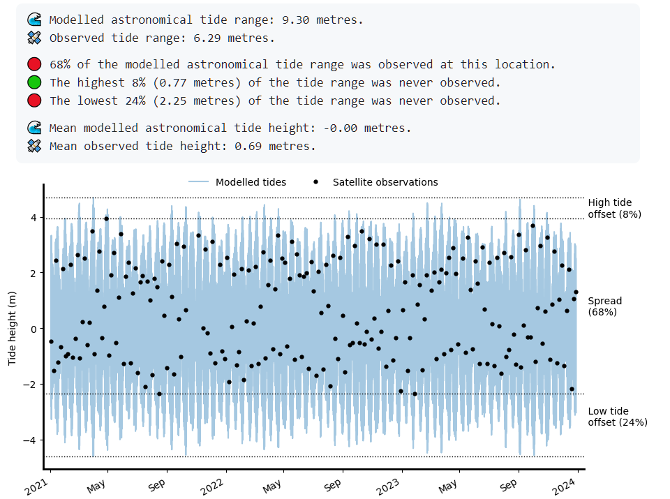

# Summary

The `eo-tides` package provides powerful parallelised tools for integrating satellite Earth observation (EO) data with ocean tide modelling. The package provides a flexible Python-based toolkit for attributing modelled tide heights to a time-series of satellite images based on the spatial extent and acquisition time of each satellite observation (\autoref{fig:abstract}).

`eo-tides` leverages advanced tide modelling functionality from the `pyTMD` tide prediction software [@pytmd], combining this capability with EO spatial analysis tools from `odc-geo` [@odcgeo]. This allows tides to be modelled in parallel using over 50 supported tide models, and returned in standardised `pandas` [@reback2020pandas; @mckinney-proc-scipy-2010] and `xarray` [@Hoyer_xarray_N-D_labeled_2017] data formats for EO analysis.

`eo-tides` tools can be applied to petabytes of freely available satellite data loaded from the cloud using Open Data Cube (ODC)'s `odc-stac` or `datacube` packages (e.g. using [Digital Earth Australia](https://knowledge.dea.ga.gov.au/guides/setup/gis/stac/) or [Microsoft Planetary Computer's](https://planetarycomputer.microsoft.com/) STAC SpatioTemporal Asset Catalogues). Additional functionality allows users to assess potential satellite-tide biases and validate modelled tides with external tide gauge data — critical considerations for ensuring the reliability and accuracy of coastal EO workflows. These open-source tools support the efficient, scalable and robust analysis of coastal EO data for any time period or location globally.

# Statement of need

Satellite remote sensing offers an unparalleled resource for examining dynamic coastal environments through time or across large regions [@turner2021satellite; @vitousek2023future]. However, the highly variable influence of ocean tides can complicate analyses, making it difficult to separate the influence of changing tides from patterns of true coastal change [@vos2019coastsat]. This is a particularly challenging for large-scale coastal EO analyses, where failing to account for tide dynamics can lead to inaccurate or misleading insights into satellite-observed coastal processes.

Conversely, information about ocean tides can provide unique environmental insights that can significantly enhance the value of EO data. Traditionally, satellite data dimensions include the geographic "where" and temporal "when" of acquisition. Introducing tide height as an additional analysis dimension allows data to be filtered, sorted, and analysed based on tidal dynamics, offering a transformative re-imagining of traditional multi-temporal EO analysis [@sagar2017item]. For instance, satellite data can be analysed to focus on ecologically significant tidal stages (e.g., high tide, low tide, spring or neap tides) or specific tidal processes (e.g., ebb or flow tides; @sent2025time).

This concept has been used to map coastal change at continental-scale [@bishop2021mapping], map intertidal zone extent and elevation [@murray2012continental; @sagar2017item; @bishop2019NIDEM], and creating tidally-constrained coastal image composites [@sagar2018composites]. However, these methods have traditionally relied on bespoke, closed-source, or difficult-to-install tide modeling tools, limiting their reproducibility and portability. To support the next generation of coastal EO workflows, there is a pressing need for efficient open-source tools for combining satellite data with tide modeling. `eo-tides` addresses this need through functionality offered in five main analysis modules (`utils`, `model`, `eo`, `stats`, `validation`) described below.

# Features

## Setting up tide models

The [`eo_tides.utils`](https://geoscienceaustralia.github.io/eo-tides/api/#eo_tides.utils) module simplifies the setup of ocean tide models, addressing a common barrier to coastal EO workflows. Tools like `list_models` provide feedback on available and supported models (\autoref{fig:list}), while `clip_models` can improve performance by clipping large model files to smaller regions, significantly reducing processing times for high-resolution models like FES2022.

## Modelling tides

The [`eo_tides.model`](https://geoscienceaustralia.github.io/eo-tides/api/#eo_tides.model) module is powered by tide modelling functionality from the `pyTMD` Python package [@pytmd].
`pyTMD` is an open-source tidal prediction software that simplifies the calculation of ocean and earth tides. Tides are frequently decomposed into harmonic constants (or constituents) associated with the relative positions of the sun, moon and Earth. `pyTMD.io` contains routines for reading and spatially interpolating major constituent values from commonly available ocean tide models. The `model_tides` function from `eo_tides.model` wraps `pyTMD` functionality to return tide predictions in a standardised `pandas.DataFrame` format, enabling integration with satellite EO data and parallelised processing for improved performance (\autoref{tab:benchmark}). Additional functions like `model_phases` classify tides into high/low/flow/ebb phases, critical for interpreting satellite-observed coastal processes like turbidity [@sent2025time].

Table: A [benchmark comparison](https://github.com/GeoscienceAustralia/eo-tides/blob/main/paper/benchmarking.ipynb) of tide modelling parallelisation, for a typical large-scale analysis involving a month of hourly tides modelled at 10,000 points using three models (FES2022, TPXO10, GOT5.6). \label{tab:benchmark}

| Cores | Parallelisation   | No parallelisation | Speedup |
| ----- | ----------------- | ------------------ | ------- |
| 8     | 2min 46s ± 663 ms | 9min 28s ± 536 ms  | 3.4x    |
| 32    | 55.9 s ± 560 ms   | 9min 24s ± 749 ms  | 10.1x   |

## Combining tides with satellite data

The [`eo_tides.eo`](https://geoscienceaustralia.github.io/eo-tides/api/#eo_tides.eo) module integrates modelled tides with `xarray`-format satellite data. These functions (\autoref{tab:tide_stats}) can be applied to attribute tides to satellite data for any coastal location on the planet, for example using open data loaded from the cloud using [ODC](https://www.opendatacube.org/) and STAC [@stac2024].

Table: Comparison of the `tag_tides` and `pixel_tides` functions. \label{tab:tide_stats}

| `tag_tides`                                                              | `pixel_tides`                                             |
| ------------------------------------------------------------------------ | --------------------------------------------------------- |
| - Assigns single tide height to each satellite image                     | - Assigns a tide height to every pixel through time       |
| - Single tide height per image can produce artefacts and discontinuities | - Produce spatially seamless results across large regions |
| - Fast, low memory use                                                   | - Slower, higher memory use                               |
| - Ideal for local, site-scale analysis                                   | - Ideal for large-scale coastal product generation        |

## Calculating tide statistics and satellite biases

The [`eo_tides.stats`](https://geoscienceaustralia.github.io/eo-tides/api/#eo_tides.stats) module identifies biases caused by complex tide alaising issues that can prevent satellites from observing the entire tide cycle [@eleveld2014estuarine; @bishop2019NIDEM; @sent2025time]. The `tide_stats` and `pixel_stats` functions produce a range of useful statistics that summarise how well satellite data captures real-world tidal conditions (\autoref{fig:stats}).

## Validating modelled tides

The [`eo_tides.validation`](https://geoscienceaustralia.github.io/eo-tides/api/#eo_tides.validation) module validates modelled tides against observed sea-level measurements, assisting users to evaluate and select optimal models for their study area or application (\autoref{fig:gesla}).

# Research projects

Early versions of `eo-tides` functions have been used for continental-scale intertidal mapping [@deaintertidal], multi-decadal shoreline mapping across Australia [@bishop2021mapping] and [Africa](https://www.digitalearthafrica.org/platform-resources/services/coastlines), and for correcting satellite-derived shoreline in the `CoastSeg` Python package [@Fitzpatrick2024].

# Acknowledgements

Functions from `eo-tides` were originally developed in the Digital Earth Australia Notebooks repository [@krause2021dea]. This paper is published with the permission of the Chief Executive Officer, Geoscience Australia (copyright 2025).

# References
